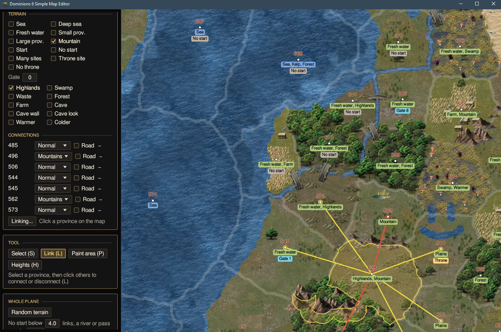

# dom6-simple-map-editor

Edits `.d6m` maps for Dominions 6. The game's editor won't touch the height data, so this will have to do.



## Run

Grab the exe from releases. Open a `.d6m` or `.map`, or drop one on the window, or:

```
dom6-simple-map-editor.exe path\to\map.d6m
```

Maps are in `%APPDATA%\Dominions6\maps`. First save leaves the originals as `.bak`. Press F1 if you're lost.
CTRL + S to save the map.

## Build

```
cargo build --release
```
